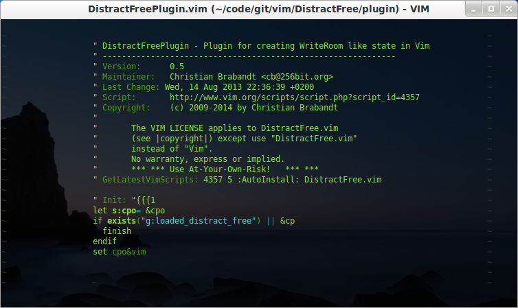

#DistractFree Mode for Vim
> A Vim plugin for enabling a distraction free writing mode

This plugin aims to make a distraction less mode for Vim similar to how WriteRoom DarkRoom or OmniWriter works.

Here is the screenshot:

###Installation
Use the plugin manager of your choice. Or download the [stable][] version of the plugin, edit it with Vim (`vim DistractFree-XXX.vmb`) and simply source it (`:so %`). Restart and take a look at the help (`:h DistractFree.txt`)

[stable]: http://www.vim.org/scripts/script.php?script_id=4357

###Usage
Once installed, use `:DistractFreeToggle` to toggle between normal mode and distraction free mode.

###License & Copyright

© 2009-2014 by Christian Brabandt. The Vim License applies. See `:h license`

__NO WARRANTY, EXPRESS OR IMPLIED.  USE AT-YOUR-OWN-RISK__
